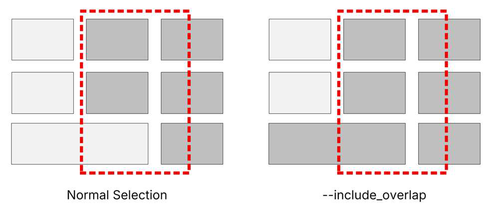
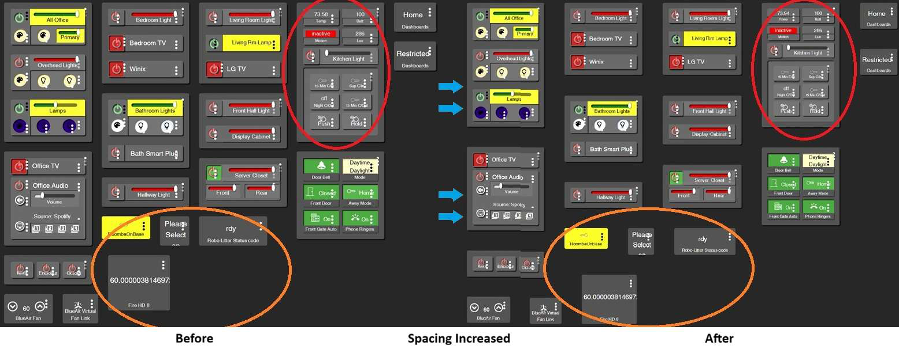
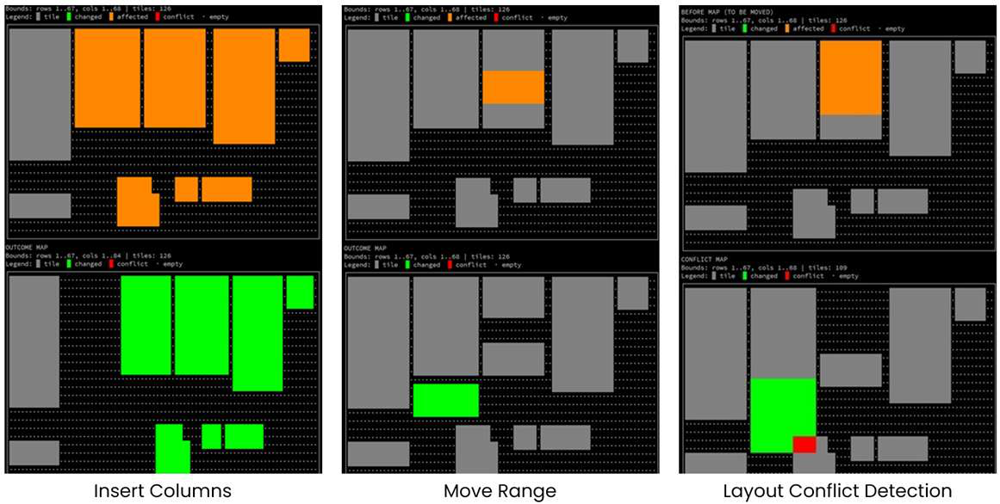
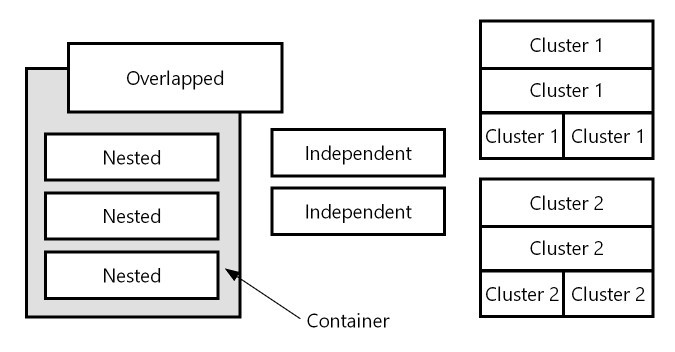

<a id="top"></a>

# Hubitat Tile Mover Tool Documentation

**Version:** `v0.9.165.2026032401`

---

<a id="table-of-contents"></a>

## Table of Contents

- [Features Overview](#features-overview)
- [Documentation Syntax](#documentation-syntax)
- [Layout Import Sources and Output Destinations](#layout-import-sources-and-output-destinations)
  - [Import Sources](#import-sources)
  - [Output Destinations](#output-destinations)
- [Layout Actions Overview](#layout-actions-overview)
  - [Action Targets - Selecting Tiles](#action-targets---selecting-tiles)
- [CSS Actions and Options](#css-actions-and-options)
  - [Insert](#insert)
  - [Move](#move)
  - [Copy](#copy)
  - [Merge](#merge)
  - [Delete](#delete)
  - [Clear](#clear)
  - [Crop](#crop)
  - [Prune](#prune)
  - [Spacing](#spacing)
  - [Trim](#trim)
  - [Copy CSS](#copy-css)
  - [Clear CSS](#clear-css)
  - [Scrub CSS](#scrub-css)
  - [Compact CSS](#compact-css)
- [Supplemental Actions and Options](#supplemental-actions-and-options)
  - [Sort (JSON Only)](#sort-json-only)
  - [Visual Layout Maps](#visual-layout-maps)
  - [Dashboard Tile Lists](#dashboard-tile-lists)
  - [Miscellaneous Options](#miscellaneous-options)
- [Custom CSS Handling - Capabilities & Limits](#custom-css-handling---capabilities--limits)
  - [CSS Overview](#css-overview)
  - [Compatible Selector Patterns](#compatible-selector-patterns)
  - [Incompatible and Problematic CSS Rules](#incompatible-and-problematic-css-rules)
  - [Tile IDs Inside Declaration Blocks](#tile-ids-inside-declaration-blocks)
  - [CSS Comments](#css-comments)
  - [Comment Block Removal - Delete/Clear/Crop/Prune/CSS Clean-up/Operations](#comment-block-removal---deleteclearcropprunecss-clean-upoperations)
- [Tool Usage Examples](#tool-usage-examples)
- [Batch Actions](#batch-actions)
- [Batched Actions in Detail](#batched-actions-in-detail)
- [License](#license)

---

<a id="features-overview"></a>

## Features Overview

➜ **Import, modify and output Hubitat dashboard layouts:**

- **IMPORT** dashboard layouts directly from:
  - the hub
  - JSON files
  - the clipboard *(default)*

- **OUTPUT** changed layouts directly to:
  - the hub
  - JSON files
  - the clipboard *(default)*

➜ **Tile Actions**

- **MOVE** columns, rows or a rectangular range of tiles
- **COPY** columns, rows or a rectangular range of tiles
- **MERGE** copy columns, rows or a rectangular range of tiles from another dashboard
- **CLEAR** columns, rows or a rectangular range of tiles but leave the empty space
- **PRUNE** a layout by tile-id or device-id; clear only specific IDs or clear all except specific IDs

➜ **Layout Actions**

- **INSERT** full or partial empty columns or rows *(push tiles over/down at column/row)*
- **DELETE** full or partial columns or rows of tiles *(remove tiles and shift the layout left or up)*
- **CROP** a layout by clearing all tiles not in columns, rows or a rectangular range
- **SPACING** change - increase, decrease or set uniform spacing between all dashboard tiles
- **TRIM** a layout to remove empty top rows and/or left columns

➜ **Additional Features**

- **CSS SUPPORT** preserve, duplicate or remove custom CSS rules when tiles are added *(copied)* or removed by actions
- **CONFLICT PREVENTION** prevent actions which would result in tiles being placed over existing tiles
- **VISUAL MAPS** easily see proposed changes, tile-ids, potential conflicts and final outcome of actions

[Back to Contents](#table-of-contents)

---

<a id="documentation-syntax"></a>

## Documentation Syntax

- `< ... >` indicates required parameters. Do **not** include the `<` or `>`.
- `"< ... >"` indicates required parameters that should be in quotes. Do **not** include the `<` or `>`.
- `[ ... ]` indicates optional parameters. Do **not** include the `[` or `]`.
- `"[ ... ]"` indicates optional parameters that should be in quotes. Do **not** include the `[` or `]`.

[Back to Contents](#table-of-contents)

---

<a id="layout-import-sources-and-output-destinations"></a>

## Layout Import Sources and Output Destinations

<a id="import-sources"></a>

### Import Sources

Sets the source to import dashboard layout JSON from.

**Setting:**

```text
--import:type
```

**Import Types:** `clipboard | file | hub`

- `--import:clipboard` — Read JSON text from clipboard. *(Default)*
- `--import:file "<filename>"` — Read JSON text from file.
- `--import:hub "<url>"` — Fetch the full layout JSON from Hubitat using `url`.

**Notes:**

- Only one instance of `--import` is allowed per run.
- Dashboard URL format *(typical)*:

```text
http://<hub-ip>/apps/api/<dashId>/dashboard/<dashId>?access_token=<token>&local=true
http://192.168.1.5/apps/api/3/dashboard/3?access_token=b123fc5c-bd6a-6d1f-7ee8-edf9012b3dc4&local=true
```

<a id="output-destinations"></a>

### Output Destinations

Sets the destination to save dashboard layout JSON after layout actions have completed.

**Setting:**

```text
--output:type
```

**Output Types:** `terminal | clipboard | file | hub`

- `--output:terminal` — Print output to terminal.
- `--output:clipboard` — Write to clipboard. *(Default)*
- `--output:file "<filename>"` — Write to file.
- `--output:hub "[url]"` — Write layout JSON back to the hub at `url`.

**Notes:**

- Output defaults to the clipboard if not specified.
- `url` can be omitted if specified with `--import:hub`.
- `--output:hub` will fail if:
  - ❌ `url` is not specified and import is not `--import:hub`
  - ❌ `url` is not a valid or reachable local dashboard URL
  - ❌ a valid `requestToken` could not be obtained

[Back to Contents](#table-of-contents)

---

<a id="layout-actions-overview"></a>

## Layout Actions Overview

➜ **Layout Action types**

- **Primary edit actions** — make modifications to tiles. Primary actions include:
  - `insert`
  - `move`
  - `copy`
  - `merge`
  - `delete`
  - `clear`
  - `crop`
  - `prune`

  Only **one** primary edit action can be used per run.

- **Supplemental actions** — can be used standalone or with primary actions. These include:
  - displaying visual layout maps
  - JSON sorting
  - orphaned CSS cleanup
  - CSS compact reformatting
  - trim functions

  Supplemental actions are always performed **after** primary actions have successfully completed.

- **Undo / restore action** — `--undo_last` is a standalone action. It supersedes all other actions.

<a id="action-targets---selecting-tiles"></a>

### Action Targets - Selecting Tiles

- **Tile Selection**
  - A tile's location is determined by the row and column of its upper-left corner.
  - A tile's span is the area it occupies, calculated as:
    - `(row + height - 1)`
    - `(column + width - 1)`
  - By default, actions are applied only to tiles that are located *(begin)* in the target rows, columns, or rectangular range.

- **Target Area Overlap**
  - Tiles that are located *(begin)* outside of the target area, but extend *(span)* into the target area, are considered target-area **overlaps**.
  - To include tiles that begin outside of the target area, but overlap its boundaries, use the `--include_overlap` switch.

- **Tile Conflicts - Destination Overlaps**
  - During move / copy actions, a tile conflict occurs when the span of a tile being copied or moved would overlap one or more existing tiles at the destination location.
  - Copy, move and merge actions will abort if conflicts occur unless `--skip_overlap` or `--allow_overlap` is present.
  - Conflict detection is evaluated **once**, before copying / moving, against existing destination tiles only.
  - Tiles that overlap in their original position are **not** considered in conflict with each other when they are moved or copied.



[Back to Contents](#table-of-contents)

---

<a id="css-actions-and-options"></a>

## CSS Actions and Options

<a id="insert"></a>

### Insert

Inserts empty whole or partial rows or columns by pushing tiles beyond the insertion point.

**Action:**

```text
--insert:mode
```

**Modes:** `rows | cols`

```text
--insert:rows <count> <at_row>
--insert:cols <count> <at_col>
```

- **rows** — Pushes down *(increases tile `row` by `count`)* tiles at/after `at_row`, and optionally tiles overlapping the insertion row.
- **cols** — Pushes right *(increases tile `col` by `count`)* tiles at/after `at_col`, and optionally tiles overlapping the insertion column.

**Selection Modifiers:**

- `--col_range <start_col> <end_col>` — insert rows only in column range. Only valid with `--insert:rows`
- `--row_range <start_row> <end_row>` — insert columns only in row range. Only valid with `--insert:cols`
- `--include_overlap`

**Option:**

- `--confirm_keep` — enables a confirmation prompt *(independent of `--force`)* after writing output, to keep or undo the changes.

<a id="move"></a>

### Move

Moves tiles to a new location.

**Action:**

```text
--move:mode
```

**Modes:** `rows | cols | range`

```text
--move:rows <start_row> <end_row> <dest_start_row>
--move:cols <start_col> <end_col> <dest_start_col>
--move:range <src_top_row> <src_left_col> <src_bottom_row> <src_right_col> <dest_top_row> <dest_left_col>
```

**Selection Modifier:**

- `--include_overlap`

**Options:**

- `--allow_overlap` — ignore conflicts and allow moved tiles to overlap existing tiles at the destination
- `--skip_overlap` — skip tiles that would conflict; move all others
- `--confirm_keep` — enables a confirmation prompt *(independent of `--force`)* after writing output, to keep or undo the changes

**Notes:**

- Conflict detection is evaluated once, before moving / copying, against existing destination tiles only.
- Tiles that are being copied / moved can be overlapped and will **not** be considered in conflict.
- Actions will be aborted if conflicts are found unless `--allow_overlap` or `--skip_overlap` is present.

<a id="copy"></a>

### Copy

Same as **Move**, but originals remain. Copies are created with new IDs. Existing tile-specific CSS rules in `customCSS` can be optionally copied with the new IDs.

**Action:**

```text
--copy:mode
```

**Modes:** `rows | cols | range`

```text
--copy:rows <start_row> <end_row> <dest_start_row>
--copy:cols <start_col> <end_col> <dest_start_col>
--copy:range <src_top_row> <src_left_col> <src_bottom_row> <src_right_col> <dest_top_row> <dest_left_col>
```

**Selection Modifier:**

- `--include_overlap`

**Options:**

- `--allow_overlap` — ignore conflicts and allow moved tiles to overlap existing tiles at the destination
- `--skip_overlap` — skip tiles that would conflict; move all others
- `--ignore_css` — disables creating / copying CSS for new IDs
- `--confirm_keep` — enables a confirmation prompt *(independent of `--force`)* after writing output, to keep or undo the changes

**Notes:**

- ID allocation for new tiles: new IDs are created sequentially beginning with:

```text
1 + max(highest existing tile ID, highest referenced tile ID in customCSS)
```

This prevents orphaned CSS rules from being applied to new tiles.

- By default, `customCSS` is checked for tile-specific CSS rules for copied tiles. Any rules found are duplicated for the new tile ID.
- Conflict detection is evaluated once, before moving / copying, against existing destination tiles only.
- Tiles that are being copied / moved can be overlapped and will **not** be considered in conflict.
- Actions will be aborted if conflicts are found unless `--allow_overlap` or `--skip_overlap` is present.

<a id="merge"></a>

### Merge

Merge *(copy)* tiles from another dashboard layout into this layout.

**Action:**

```text
--merge:mode --merge_source:type "<filename | url>"
```

**Modes:** `rows | cols | range`

```text
--merge:rows <start_row> <end_row> <dest_start_row>
--merge:cols <start_col> <end_col> <dest_start_col>
--merge:range <src_top_row> <src_left_col> <src_bottom_row> <src_right_col> <dest_top_row> <dest_left_col>
```

**Source Types (required):** `file | hub`

- `--merge_source:file "<filename>"` — load dashboard JSON from file
- `--merge_source:hub "<other_dashboard_local_url>"` — fetch dashboard JSON directly from the hub

**Selection Modifier:**

- `--include_overlap`

**Options:**

- `--allow_overlap` — ignore conflicts and allow moved tiles to overlap existing tiles at the destination
- `--skip_overlap` — skip tiles that would conflict; move all others
- `--ignore_css` — disables creating / copying CSS for new IDs
- `--confirm_keep` — enables a confirmation prompt *(independent of `--force`)* after writing output, to keep or undo the changes

**Notes:**

- ID allocation for new tiles: new IDs are created sequentially beginning with:

```text
1 + max(highest existing tile ID, highest referenced tile ID in customCSS)
```

This prevents orphaned CSS rules from being applied to new tiles.

- By default, `customCSS` is checked for tile-specific CSS rules for copied tiles. Any rules found are duplicated for the new tile ID.
- Conflict detection is evaluated once, before moving / copying, against existing destination tiles only.
- Tiles that are being copied / moved can be overlapped and will **not** be considered in conflict.
- Actions will be aborted if conflicts are found unless `--allow_overlap` or `--skip_overlap` is present.

<a id="delete"></a>

### Delete

Deletes tiles located in the target rows or columns, then shifts remaining tiles to close the gap.

**Action:**

```text
--delete:mode
```

**Modes:** `rows | cols`

```text
--delete:rows <start_row> <end_row>
--delete:cols <start_col> <end_col>
```

**Selection Modifiers:**

- `--row_range <start_row> <end_row>` — deletes columns only in row range. Only valid with `--delete:cols`
- `--col_range <start_col> <end_col>` — deletes rows only in column range. Only valid with `--delete:rows`
- `--include_overlap`

**Options:**

- `--force` — skip confirmation prompts; assume yes
- `--confirm_keep` — enables a confirmation prompt *(independent of `--force`)* after writing output, to keep or undo the changes
- `--cleanup_css` — remove tile-scoped CSS rules from `customCSS` for tiles removed or cleared by the current action

**Notes:**

- The default behavior is to leave tile CSS rules for tiles removed or cleared by the current operation in place, unless `--cleanup_css` is present.
- Use `--scrub_css` to remove all orphaned CSS rules, including rules for tiles removed or cleared by the current operation.

<a id="clear"></a>

### Clear

Removes tiles in the target rows, columns or range but does **not** change the dashboard layout.

**Action:**

```text
--clear:mode
```

**Modes:** `rows | cols | range`

```text
--clear:rows <start_row> <end_row>
--clear:cols <start_col> <end_col>
--clear:range <top_row> <left_col> <bottom_row> <right_col>
```

**Selection Modifier:**

- `--include_overlap`

**Options:**

- `--force` — skip confirmation prompts; assume yes
- `--confirm_keep` — enables a confirmation prompt *(independent of `--force`)* after writing output, to keep or undo the changes
- `--cleanup_css` — remove tile-scoped CSS rules from `customCSS` for tiles removed or cleared by the current action

**Notes:**

- The default behavior is to leave tile CSS rules for tiles removed or cleared by the current operation in place, unless `--cleanup_css` is present.
- Use `--scrub_css` to remove all orphaned CSS rules, including rules for tiles removed or cleared by the current operation.

<a id="crop"></a>

### Crop

Clears tiles outside of the target rows, columns or range. The position of remaining tiles is unchanged.

**Action:**

```text
--crop:mode
```

**Modes:** `rows | cols | range`

```text
--crop:rows <start_row> <end_row>
--crop:cols <start_col> <end_col>
--crop:range <top_row> <left_col> <bottom_row> <right_col>
```

**Selection Modifier:**

- `--include_overlap`

**Options:**

- `--force` — skip confirmation prompts; assume yes
- `--confirm_keep` — enables a confirmation prompt *(independent of `--force`)* after writing output, to keep or undo the changes
- `--cleanup_css` — remove tile-scoped CSS rules from `customCSS` for tiles removed or cleared by the current action

**Notes:**

- The default behavior is to leave tile CSS rules for tiles removed or cleared by the current operation in place, unless `--cleanup_css` is present.
- Use `--scrub_css` to remove all orphaned CSS rules, including rules for tiles removed or cleared by the current operation.
- At least one tile must remain after cropping.
- Use `--trim`, `--trim:top` or `--trim:left` to remove blank rows and columns above or left of the remaining tiles.

<a id="prune"></a>

### Prune

Clears tiles based on a list of either tile-id numbers or device-id numbers. `--prune` removes only those tiles listed, while `--prune_except` removes all tiles except those listed. Pruned tiles are cleared. No changes are made to the layout of the remaining tiles.

**Actions:**

```text
--prune:mode
--prune_except:mode
```

**Modes:** `ids | devices`

```text
--prune:ids <list>
--prune:devices <list>
--prune_except:ids <list>
--prune_except:devices <list>
```

**Acceptable list values:**

- Explicit values: `1,4,6,8,9`
- Comparisons: `<29`
- Inclusive ranges: `3-20,40-58`
- Combination: `<29,43,46,>=100`

**Options:**

- `--force` — skip confirmation prompts; assume yes
- `--confirm_keep` — enables a confirmation prompt *(independent of `--force`)* after writing output, to keep or undo the changes
- `--cleanup_css` — remove tile-scoped CSS rules from `customCSS` for tiles removed or cleared by the current action

**Notes:**

- If `--cleanup_css` is not present, tile-scoped custom CSS rules referencing removed or cleared tiles will be left in place.
- Use `--scrub_css` to remove all orphaned CSS rules, including rules for tiles removed or cleared by the current operation.
- At least one tile must remain after pruning.
- Use `--trim`, `--trim:top` or `--trim:left` to remove blank rows on the top or columns on the left of the remaining tiles.

<a id="spacing"></a>

### Spacing

Increases, decreases, or sets uniform spacing between all dashboard tiles.

**Actions:**

```text
--spacing_add:mode
--spacing_set:mode
```

**Modes:** `rows | cols | all`

```text
--spacing_add:rows <+/- cells>
--spacing_add:cols <+/- cells>
--spacing_add:all <+/- cells>
--spacing_set:rows <# of cells>
--spacing_set:cols <# of cells>
--spacing_set:all <# of cells>
```

- **add** — increase or decrease space between tiles by adding empty cells to rows and/or columns between tiles. Use a positive number to increase spaces by that many cells, or a negative number to decrease existing spacing.
- **set** — set the spacing uniformly around all tiles to the number of cells.

**Options:**

- `--include_overlap` — changes spacing of overlapping tiles individually rather than as a group
- `--confirm_keep` — enables a confirmation prompt *(independent of `--force`)* after writing output, to keep or undo the changes

**Notes:**

- **Overlapping Tiles**
  - Overlapping tiles are treated as a grouped single tile with a span equal to the total union of the group. *(The tile with the farthest right edge or bottom edge in the group determines the size of the group tile.)*
  - Overlapping tiles that share the same top-left corner *(location)* are treated as a single merged tile and kept together when spacing is applied.
  - Individual tile sizes remain unchanged.

- **Example**

  In this example, spacing was set to **2 rows** and **2 columns** between tiles (`--spacing:all 2`). Spaces around individual tiles *(orange circle)* increased. `--include_overlap` was not specified, so groups of tiles *(red circle)* were treated as a single tile. Space around the group was increased while maintaining the interior spacing.



- Tiles do not need to be uniformly sized or in straight columns or rows. However, applying uniform spacing to complex layouts with wide differences in tile sizes can lead to unpredictable outcomes.
- Spacing between tiles will never be reduced below zero.
- `--include_overlap` will make a "best effort" to increase or decrease space between tiles within groups as well as between all other tiles. Because spacing changes within a group of tiles will change the size of the grouped tile, results may be unpredictable.
- `--no_overlap` will distribute all overlapping tiles into the layout. Depending on the number of overlapping tiles, moving overlapping tiles into the layout may result in significant changes to the position of other tiles. This is particularly useful when adding many tiles quickly to a dashboard. Tiles can be added haphazardly, then spread out by setting spacing and using the `--no_overlap` option.

<a id="trim"></a>

### Trim

Removes blank rows above the top-most tile and/or blank columns left of the left-most tile.

**Action:**

```text
--trim:mode
```

**Modes:** `top | left | (top,left)`

```text
--trim                  (defaults to top,left)
--trim:top
--trim:left
--trim:top,left
--trim:left,top
```

**Option:**

- `--confirm_keep` — enables a confirmation prompt *(independent of `--force`)* after writing output, to keep or undo the changes

**Notes:**

- The trim action can be used in conjunction with another action or as a standalone action.
- When combined with another action, trimming will only occur after successful completion of the primary action.

<a id="copy-css"></a>

### Copy CSS

Copies CSS rules from one tile to another.

**Action:**

```text
--copy_css:mode
```

**Modes:** `merge | replace | overwrite | add`

```text
--copy_css:merge <from_tile-id> <to_tile-id>
--copy_css:replace <from_tile-id> <to_tile-id>
--copy_css:overwrite <from_tile-id> <to_tile-id>
--copy_css:add <from_tile-id> <to_tile-id>
```

- **merge** — copies rules while checking for conflicts with existing rules. Conflicts generate a user prompt to overwrite or keep *(default)* existing rules.
- **replace** — removes all rules from the destination tile and replaces them with the copied rules. Generates a confirmation prompt before proceeding.
- **overwrite** — copies rules while checking for conflicts with existing rules. Conflicts generate a user prompt to overwrite *(default)* or keep existing rules.
- **add** — copies all rules to the target tile regardless of potential conflicts. Conflicts generate a user prompt to confirm adding *(default)* or skipping conflicting rules.

**Option:**

- `--force` — skip confirmation prompts and select the default response

**Notes:**

- All modes generate a confirmation prompt if `--force` is not present.
- Rule conflicts are rules having the same scope and declarations.

**Examples:**

- **Contains conflicts:**

```text
#tile-123 {color: red; padding: 5px;}   vs   #tile-141 {margin: 2px; padding: 3px;}
```

- **Not a conflict:**

```text
#tile-123 {background-color: blue; color: red;}   vs   #tile-141 {margin: 2px; padding: 5px;}
```

- **Merge** and **overwrite** differ only in the default action taken when used with `--force`.
- **Add** is a combination of merge and overwrite modes. In the event of conflicting rules, both are kept.

<a id="clear-css"></a>

### Clear CSS

Removes CSS rules in `customCSS` with selectors referencing a tile-id.

**Action:**

```text
--clear_css "<list>"
```

**Acceptable list values:**

- Explicit values: `1,4,6,8,9`
- Comparisons: `<29`
- Inclusive ranges: `3-20,40-58`
- Combination: `<29,43,46,>=100`

**Option:**

- `--force` — skip confirmation prompts; assume yes

**Note:**

Only CSS rules for existing tiles can be cleared. Orphaned rules can only be removed with the `--scrub_css` action.

<a id="scrub-css"></a>

### Scrub CSS

Removes all tile-scoped CSS rules from `customCSS` with selectors that reference tiles no longer in the current dashboard layout.

**Action:**

```text
--scrub_css
```

**Option:**

- `--force` — skip confirmation prompts; assume yes

**Notes:**

- May be used as a standalone primary action or as a supplemental action after the primary action has completed successfully.
- See [CSS Overview](#css-overview) for more information.

<a id="compact-css"></a>

### Compact CSS

**Overview:**

- Reformats `customCSS` in a compact, sortable and more easily parsed format.
- Selector rules are output as **one line each**.
- Rule bodies are condensed to one line *(whitespace compacted; strings/comments preserved as text)*.
- Selector lists are split to separate rules per selector.

**Example CSS:**

```text
#tile-4, #tile-123 { ... }
→ #tile-4 { ... }
→ #tile-123 { ... }
```

- Rules are sorted in groups:
  1. Root tags, not tile-ids, etc.
  2. Non-tile class selectors starting with `.` excluding `.tile-id`
  3. Tile class selectors (`#tile-id`, `.tile-id`) ordered by tile-id
  4. Commented-out rules and comments with tile references (`#tile-id`, `.tile-id`) are sorted with other tile selectors
  5. Comments that do not contain specific tile references are sorted into group 1

**Action:**

```text
--compact_css
```

**Notes:**

- CSS reformatting is performed last, after all other operations have completed, and can be used as a standalone primary action or as a supplemental action.
- See [CSS Overview](#css-overview) for more information.

[Back to Contents](#table-of-contents)

---

<a id="supplemental-actions-and-options"></a>

## Supplemental Actions and Options

<a id="sort-json-only"></a>

### Sort (JSON Only)

Changes the order tiles appear in the dashboard layout JSON only.

**Action:**

```text
--sort:<spec>
```

**Spec Keys:** `i | -i | r | -r | c | -c`

- `[-]i` = id *
- `[-]r` = row
- `[-]c` = col

- Keys are sorted in ascending order unless preceded by `-`
- * IDs should be unique and therefore should be the last sort key
- Default sort order is **row, column, id** (`rci`)

**Notes:**

- Sorting only changes the order tiles are listed in the dashboard JSON. It has **no effect** on the layout.
- By default, actions do not change the order tiles are listed in the layout JSON unless `--sort` is present.
- The default sort order is `i` *(index)* in ascending order.
- Ascending or descending order can be specified for each key. Examples:
  - `--sort:rc-i`
  - `--sort:-r-ci`
- Missing sort keys are assumed. For example, `--sort:c` will result in `--sort:cri`.
- Use `--compact_css` to sort CSS rules in `customCSS`.

<a id="visual-layout-maps"></a>

### Visual Layout Maps

Show before, outcome and conflict layout previews in the terminal.

**Action:**

```text
--show_map:mode
```

**Modes:** `full | no_scale | conflicts`

```text
--show_map:full
--show_map:no_scale
--show_map:conflicts
```

- **full** — maps show the full dashboard, scaled to fit the terminal
- **no_scale** — show the full layout without scaling. Rows and columns are represented by one character space and may not display properly depending on terminal size.
- **conflicts** — zooms to show only tiles in conflict without scaling. All other maps are full-layout with scaling.

**Options:**

- `--show_ids` — displays tile-ids on maps
- `--show_axis:<row | col | all>` — display row and/or column numbers on axes

**Note:**

When using `--show_ids`, small or overlapping tiles may be represented by a group letter on layout maps. Tiles that have been grouped will be listed below the map.

**Map Legend:**

- `●` *(gray dot)* — empty spaces
- `█` *(gray)* — unaffected tiles
- `█` *(orange)* — tiles in the target row, column or range before changes are made
- `█` *(green)* — tiles successfully changed by the action or portions not in conflict
- `█` *(red)* — tiles *(or portions)* in conflict that caused the action to fail
- `█` *(yellow)* — tile conflicts allowed by `--allow_overlap`



<a id="dashboard-tile-lists"></a>

### Dashboard Tile Lists

Generate lists of dashboard tiles and basic attributes.

**Action:**

```text
--list_tiles:mode:sort
```

**Modes:** `plain | overlap | nested | conflict`

```text
--list_tiles:plain:sort
--list_tiles:overlap:sort
--list_tiles:nested:sort
--list_tiles:conflicts:sort
```

- **Plain** — list all tiles in sort order with attributes in columns
- **Overlap** — list tiles which partially overlap other tiles
- **Nested** — list tiles which are nested *(the entire tile overlaps another)* inside another tile
- **Conflicts** — list all tiles with shared origins, overlap, potential duplicates, CSS rule conflicts, etc.

**Sort Keys:** `i | -i | r | -r | c | -c`

- `[-]i` = id †
- `[-]p` = placement *
- `[-]r` = row
- `[-]d` = device *
- `[-]c` = col
- `[-]t` = template *
- `[-]h` = height *
- `[-]s` = css rules *
- `[-]w` = width *

- Default sort order for keys is ascending unless preceded by `-`
- * Plain list format only
- † IDs should be unique and therefore should be the last sort key

**Examples:**

```text
--list_tiles:plain:drc-pi
```

List in plain format, sort by device, row, column, placement *(descending)*, id.

```text
--list_tiles:nested:r-c
```

List nested tiles, sort by row, column *(descending)*, id.

**Plain List Fields:**

- **Tile-ID**
- **Row, Col** — location of upper-left corner
- **Height, Width** — number of rows / columns that make up the tile's span
- **Placement Type**
  - **Independent** — standalone tile. Tile is not overlapping or nesting and does not touch any other tile. If dashboard tiles are laid out without space between them, all non-overlapping tiles are considered independent.
  - **Cluster** — tile touches one or more other tiles *(does not overlap)* where the union of those tiles forms a distinct group with empty space around it. If all dashboard tiles are laid out without space between them, all tiles are considered independent.
  - **Nested** — tile is an overlapping tile whose span is completely contained within the span of another tile.
  - **Overlapping** — tile span is partially overlapped by another tile.
  - **Container** — tile that contains nested tiles but is not nested within any other tile.
- **Device**
- **Template**
- **CSS Rules** — number of rules or comments found in `customCSS` referencing that tile-id



**Notes:**

- `--list_tiles` is a standalone action that cannot be combined with any other operations.
- Use `--output` destination to save listings. `--output:hub` is not valid.
- If no `--output` destination is specified, output defaults to the terminal.
- In conflict lists, tiles with shared origins are overlapping tiles that begin at the same upper-left corner location.

<a id="miscellaneous-options"></a>

### Miscellaneous Options

➜ **Prompts / Confirmation Options**

- `--force` — suppress confirmation prompts for actions which remove tiles or custom CSS rules
- `--confirm_keep` — enables a confirmation prompt *(independent of `--force`)* after writing output, to keep or undo the changes

➜ **Safety / Undo Options**

- `--lock_backup` — retains the last undo backup *(if found)* as the undo backup for the current action
- `--undo_last` — loads the undo backup *(if found)* and writes it to the previous action's output destination

**Notes:**

- `--undo_last` may be used with `--output:<type>` to override where the undo will be restored to. However, the restore destination type must match the specified output type. For example, if the last output was a file, a new filename can be specified, but the new output type must still be `file`.
- Backup files contain the JSON imported **before** an action is performed. The backup file is not created until after the action completes and the result has been successfully saved to the output destination.
- When restoring directly to the hub, there are additional safeguards to prevent:
  - restoring and overwriting a different dashboard than the dashboard layout in the undo file
  - restoring an older backup than intended *(undo is older than 5 minutes)*
  - overwriting dashboard edits made after the backup was created *(the current dashboard layout stored on the hub does not match the layout that was uploaded last)*
- A confirmation prompt will be presented if any safeguard is triggered. Use `--force` to suppress prompts.
- The purpose of `--confirm_keep` is to provide an opportunity to review or test the outcome of an action, then undo it if necessary. This is the same as running an action without `--confirm_keep`, then using `--undo_last`.

➜ **Output / Debug Information Options**

- `--quiet` — suppress end-of-run summary line *(errors still shown)*
- `--verbose` — planned actions + concise results
- `--debug` — per-tile action logs + deep details

➜ **Help**

- `-h, --help` — short help
- `--help:full` — full detailed help

[Back to Contents](#table-of-contents)

---

<a id="custom-css-handling---capabilities--limits"></a>

## Custom CSS Handling - Capabilities & Limits

<a id="css-overview"></a>

### CSS Overview

- When tiles are copied / merged *(new tile IDs are created)* or removed *(delete / clear / crop / prune)*, the tool can optionally update `customCSS` by:
  - duplicating tile-scoped rules for the new tile IDs
  - removing tile-scoped rules for removed tile IDs with `--cleanup_css`
  - scrubbing orphaned tile-scoped rules with `--scrub_css`

- CSS parsing is limited to typical Hubitat dashboard CSS, not full CSS grammar. Specifically, the parser can only "see" and process **tile-scoped** rules and has limited support for rules inside comment blocks.
- Inconsistent formatting, line breaks and whitespace may interfere with CSS parsing.

**CSS Rule Guidelines**

- A rule is treated as tile-scoped when its selector *(the part before `{...}`)* contains a tile identifier such as `#tile-123` or `.tile-123`.
- Declarations do **not** define ownership. Tile-like text inside the declaration block (`{ property: value; }`) is not enough to associate a rule with a tile unless the selector also scopes the rule to that tile.
- Rules inside `@media { ... }` blocks can be duplicated / removed, but the tool does not attempt to fully normalize complex nested at-rules.
- Use `--ignore_css` if your `customCSS` contains advanced selector patterns or complicated blocks you do not want rewritten.
- Avoid using `--copy_css`, `--cleanup_css` and `--scrub_css` on dashboards with CSS that intentionally cross-references multiple tiles in a single selector item.

<a id="compatible-selector-patterns"></a>

### Compatible Selector Patterns

➜ **Compatible selector patterns**

✅ **Single selector item scoped to one tile**

**Example CSS:**

```text
#tile-123 { <declarations> }
.tile-123 { <declarations> }
#tile-123 .icon { <declarations> }
```

➡️ **Copy / merge behavior** *(copy `123` ➡️ `141`)*

☞ Rules for copied tiles are unchanged.

```text
#tile-123 { <declarations> }
.tile-123 { <declarations> }
#tile-123 .icon { <declarations> }
```

☞ Selectors are duplicated and remapped to new tiles.

```text
#tile-141 { <declarations> }
.tile-141 { <declarations> }
#tile-141 .icon { <declarations> }
```

➡️ **When removing tile `123`:**

<del><code>#tile-123 { &lt;declarations&gt; }</code></del>  
<del><code>.tile-123 { &lt;declarations&gt; }</code></del>  
<del><code>#tile-123 .icon { &lt;declarations&gt; }</code></del>

✅ **Selector list (comma-separated) containing tile selectors**

**Example CSS:**

```text
#tile-4, #tile-20, #tile-123 { <declarations> }
```

➡️ **Copy / merge behavior** *(copy `123` ➡️ `141`)*

☞ The original rule remains unchanged  
☞ A new, single selector rule is created for the new tile

```text
#tile-4, #tile-20, #tile-123 { <declarations> }
#tile-141 { <declarations> }
```

➡️ **Removal behavior** *(remove tile `123`)*

☞ Only the selector item matching the removed tile is removed  
☞ If the selector list becomes empty, the whole rule is removed

```text
#tile-4, #tile-20 { <declarations> }
```

✅ **Rules inside `@media` blocks**

**Example CSS:**

```text
@media (max-width: 600px) {
  #tile-50 { <declarations> }
  #tile-123 { <declarations> }
}
```

➡️ **Copy / merge behavior** *(copy `123` ➡️ `141`)*

☞ A new, single selector rule is created for the new tile and placed inside the `@media` block.

```text
@media (max-width: 600px) {
  #tile-50 { <declarations> }
  #tile-123 { <declarations> }
  #tile-141 { <declarations> }
}
```

➡️ **Removal behavior** *(remove tile `123`)*

☞ Only the selector item matching the removed tile is removed  
☞ If the selector list becomes empty, the whole rule is removed  
☞ The `@media` block will not be removed, even if all rules are removed

```text
@media (max-width: 600px) {
  #tile-50 { <declarations> }
  #tile-141 { <declarations> }
}
```

<a id="incompatible-and-problematic-css-rules"></a>

### Incompatible and Problematic CSS Rules

➜ **Incompatible and Problematic CSS Rules**

❌ **Multi-Tile Selector Items**

Avoid selector patterns where one selector item references multiple tiles at once. They are problematic because when copying one tile *(e.g., `123` ➡️ `141`)*, the tool would have to guess what to do with the other tile IDs in the same selector item - often producing hybrid selectors that look meaningful but match nothing. These should **not** be confused with selector lists.

**Examples**

✅ **Selector Lists**

```text
#tile-4, #tile-20, #tile-123 { ... }
```

Selector lists are compatible but not bulletproof. For best results, use separate single-selector rules.

❌ **Compound Selectors with multiple tile-ids**

```text
.tile-80.tile-123 { ... }
```

Avoid selectors requiring one element to have **both classes** at the same time. Hubitat tile containers typically represent one tile-id, so the duplicate selector is usually "dead CSS."

❌ **Child Combinator with multiple tile-ids**

```text
.tile-80 > .tile-123 { ... }
```

Avoid selectors where one tile is a direct child of another. Hubitat tiles are normally siblings in the grid, not nested.

❌ **Descendant Combinator with multiple tile-ids**

```text
#tile-80 #tile-123 .icon { ... }
```

Avoid nested selectors, or chains of multiple tile IDs. Hubitat dashboard tiles are normally siblings in a grid *(not nested tiles)*.

❌ **Rules with no tile-scoping selector**

```text
.some-class::after { content: "..." }
.tile .tile-content { padding: 0; }
```

These rules are not associated with a specific tile ID, so they are not duplicated / removed by tile-id operations.

<a id="tile-ids-inside-declaration-blocks"></a>

### Tile IDs Inside Declaration Blocks

🟡 **Tile IDs inside declaration blocks**

Tile references within the declaration block are remapped if the tile references match the selector's tile. All other rules are duplicated verbatim.

**Example 1**

Tile reference matches the selector and is remapped in duplicated rule:

✅ <code><mark>#tile-123</mark> .tile-content { background-image: url("/images/<mark>tile-123</mark>.png"); }</code>

➡️ **Copy `123` ➡️ `141`:**

- <code><mark>#tile-123</mark> .tile-content { background-image: url("/images/<mark>tile-123</mark>.png"); }</code>
- <code><mark>#tile-141</mark> .tile-content { background-image: url("/images/<mark>tile-141</mark>.png"); }</code>

**Example 2**

Tile reference does **not** match the selector and is duplicated verbatim:

🟡 <code><mark>#tile-123</mark> .tile-content { background-image: url("/images/tile-999.png"); }</code>

➡️ **Copy `123` ➡️ `141`:**

- <code><mark>#tile-123</mark> .tile-content { background-image: url("/images/tile-999.png"); }</code>
- <code><mark>#tile-141</mark> .tile-content { background-image: url("/images/tile-999.png"); }</code>

<a id="css-comments"></a>

### CSS Comments

➜ **CSS Comments**

Comment blocks within CSS can be problematic, complicate parsing, and be difficult to manage when rules are added or removed.

#### Comment Block Duplication - Copy/Merge Operations

**Standalone (statement-level) comments**

- Appear in their own CSS statement, including:
  - top-level in the stylesheet
  - inside an `@media { ... }` block, but **not** inside any rule `{ ... }` declaration body
  - rules which follow top-level rules and are outside of any rule `{ ... }` declaration body

- A standalone comment is duplicated only if:
  - it references a tile-id being duplicated *(e.g., `tile-123`)*
  - the destination tile-id will also receive at least one duplicated real selector rule
  - the comment references **no more than one** tile-id

If those conditions are met:

- the comment is duplicated **once per** `OLD` ➡️ `NEW`
- its tile-id text is remapped
- it is annotated

**Example CSS:**

```text
/* tile-123 note */
```

➡️ **Copy `123` ➡️ `141`:**

```text
/* tile-141 note [hubitat_tile_mover] duplicated tile-123 to tile-141. */
```

#### Rule-body comments

- Appear inside a selector block's declaration body.
- A rule-body comment is copied automatically as part of the duplicated rule *(because rule body text is always duplicated)*.

**Example CSS:**

```text
#tile-123 {
  /* inside the rule body */
  color: red;
}
```

➡️ **Copy `123` ➡️ `141`:**

☞ The comment block is copied with the rule body.

```text
#tile-141 {
  /* inside the rule body */
  color: red;
}
```

#### Selector-prelude comments

- Appear embedded in the selector text itself.
- Comments are only copied if they are part of the selector being copied.

**Example CSS:**

<code>#tile-4 /* cmnt 1 */, <mark>/* cmnt 2 */ #tile-123 /* cmnt 3 */</mark>, #tile-5 { ... }</code>

➡️ **Copy `123` ➡️ `141`:**

☞ All of the content between the commas is considered part of the same selector and duplicated.

- <code>#tile-4 /* cmnt 1 */, <mark>/* cmnt 2 */ #tile-123 /* cmnt 3 */</mark>, #tile-5 { ... }</code>
- <code><mark>/* cmnt 2 */ #tile-141 /* cmnt 3 */</mark> { ... }</code>

#### Rules inside comment blocks / commented-out rules

- If target tile-ids are found in a comment block, the block is parsed to determine whether the comment contains valid CSS rules with a selector matching the target tile-id.
- If no valid rules are located, the comment block is treated as a standard standalone comment.
- If one or more valid rules are found in the comment block with selectors containing the target tile-id:
  - rules with selectors containing the target tile-id are extracted
  - extracted rules are processed as normal CSS rules
  - when copying or merging tiles, the duplicated CSS is placed back inside comment delimiters
  - the duplicated comment block will contain **only** the duplicated rules; all other content in the original comment block is ignored
- If valid rules are located, but none have selectors containing the target tile-id, the comment block is treated as a standard standalone comment.

**Examples**

<table>
  <tr>
    <th align="left">Comments in separate blocks</th>
    <th align="left">Comments in same block</th>
  </tr>
  <tr>
    <td valign="top">
      <pre>/* a note about tile-123 */
/* #tile-123 { ... } */</pre>
      <p>➡️ <strong>Copy <code>123</code> ➡️ <code>141</code>:</strong></p>
      <pre>/* a note about tile-123 */
/* #tile-123 { ... } */
/* a note about tile-141 */
/* #tile-141 { ... } */</pre>
      <ul>
        <li>☞ Selectors found in standalone comment blocks</li>
        <li>☞ Only one selector found matching target tile</li>
        <li>☞ Each comment block is duplicated and remapped individually</li>
      </ul>
    </td>
    <td valign="top">
      <pre>/* a note about tile-123 */
#tile-123 { ... }
#tile-621 { ... } */</pre>
      <p>➡️ <strong>Copy <code>123</code> ➡️ <code>141</code>:</strong></p>
      <pre>/* #tile-123 { ... } */
/* #tile-141 { ... } */</pre>
      <ul>
        <li>☞ Standalone comment block contains rules for multiple selectors</li>
        <li>☞ Only the rule with the matching tile selector is extracted and duplicated</li>
        <li>☞ All other content in the block is ignored</li>
        <li>☞ Extracted rule is placed in a new comment block</li>
      </ul>
    </td>
  </tr>
</table>

<a id="comment-block-removal---deleteclearcropprunecss-clean-upoperations"></a>

### Comment Block Removal - Delete/Clear/Crop/Prune/CSS Clean-up/Operations

When tiles are removed and `--cleanup_css` is present during delete, clear, crop, and prune actions - or when CSS rules are removed during `--clear_css` or `--scrub_css` operations:

- the tool removes tile-scoped selector rules for the removed tile IDs
- if there are standalone comments referencing removed tile IDs, the tool prompts *(unless `--force`)*
- if comments are kept after rules are removed, the tool:
  - annotates the comment to document that the tile / rules were removed
  - rewrites tile-id tokens to **neutralized** forms

**Example:**

```text
/* styles for #tile-123 */
```

➡️ `#tile-123` ➡️ `#tile_123`

☞ The neutralized tokens (`tile_123`, `#tile_123`, `.tile_123`) are intentionally **not valid selectors** for the real tile. They exist to make it obvious the comment is historical and to prevent confusion during later review.

```text
/* [hubitat_tile_mover] tile(s) removed; CSS rules removed for: tile_123 */
```

[Back to Contents](#table-of-contents)

---

<a id="tool-usage-examples"></a>

## Tool Usage Examples

➡️ **Insert 2 columns at col 15 *(only in rows 4-32)***

```text
python hubitat_tile_mover.py --insert:cols 2 15 --row_range 4 32
```

➡️ **Move columns 1-14 to start at 85 and save back to hub. Show the layout before and after maps**

```text
python hubitat_tile_mover.py --import:hub "<dashboard_local_url>" --move:cols 1 14 85 --output:hub --show_map
```

➡️ **Copy tiles in the rectangular range 1,1 to 20,20 to a new location at 40,40**

```text
python hubitat_tile_mover.py --copy:range 1 1 20 20 40 40
```

➡️ **Crop to a range *(delete everything outside)*, show maps, force, clean up CSS, save to a file**

```text
python hubitat_tile_mover.py --crop:range 1 1 85 85 --show_map --force --cleanup_css --output:file "<filename.json>"
```

➡️ **Remove orphan CSS rules only *(no tile edits)* without confirmation prompt**

```text
python hubitat_tile_mover.py --scrub_css --force
```

➡️ **Undo last run *(restore last input to last outputs unless overridden)***

```text
python hubitat_tile_mover.py --undo_last
```

[Back to Contents](#table-of-contents)

---

<a id="batch-actions"></a>

## Batch Actions

**Tips for running batched or consecutive actions**

- Use `--lock_backup` on all actions except the first action. This provides an undo from before any actions in the batch were run.
- Reduce risk and increase speed by minimizing use of the clipboard to read and write intermediate layouts in batches.

**Example Batch**

**Batch Overview**

- Get the dashboard layout from the hub and insert 5 empty columns at column 10.
- Merge *(copy)* columns 15-20 from another dashboard into columns 10-15 of this dashboard.
- Crop the resulting layout to keep only tiles in the rectangular region `10,10 - 40,30`.
- Trim empty rows left behind at the top and left sides.
- Clean up orphaned CSS rules and output the final layout back to the hub.

**Example:**

```text
python hubitat_tile_mover.py --import:hub "<dashboard_local_url>" --output:clipboard --insert:cols 5 10
python hubitat_tile_mover.py --import:clipboard --output:clipboard --merge_source:hub "<other_dashboard_url>" --merge:cols 15 20 10 --lock_backup
python hubitat_tile_mover.py --import:clipboard --output:hub "<dashboard_local_url>" --crop:range 10 10 40 30 --include_overlap --force --cleanup_css --trim --lock_backup
```

[Back to Contents](#table-of-contents)

---

<a id="batched-actions-in-detail"></a>

## Batched Actions in Detail

➡️ **The first action *(run)*: `--insert:cols`**

1. Imports a layout from the hub.
2. Inserts **5** blank columns at column **10** in the layout.
3. Writes the new layout to the clipboard.
4. Saves the original imported layout to the undo backup file.

In the event of an error, running `--undo_last` would not be necessary to undo any actions performed by the batch because they have only been saved to the clipboard. The original layout still exists unchanged on the hub.

➡️ **The second action: `--merge:cols`**

1. Imports the layout saved by the first action from the clipboard.
2. Copies tiles in columns **15-20** from another dashboard into the blank columns created by the previous action at column **10**.
3. Writes the new layout to the clipboard.
4. Does **not** change the undo backup created by the first action.

In the event of an error, running `--undo_last` would not be necessary to undo any actions performed by the batch because they have only been saved to the clipboard. The original layout still exists unchanged on the hub.

➡️ **The third action: `--crop:range` → `--trim:top,left` → `--cleanup_css`**

1. Imports the layout saved by the second action from the clipboard.
2. Removes all dashboard tiles except those located in, or having some portion inside, the rectangular range from **(row 10, col 10)** to **(row 40, col 30)**.
3. Bypasses the tile-removal confirmation prompt.
4. Removes tile-specific CSS rules from `customCSS` for tiles that were removed.
5. Bypasses the CSS rule-removal confirmation prompt.
6. Trims blank columns and rows from the top and left sides to move the remaining layout as far toward the upper-left as possible.
7. Writes the final new layout to the hub.
8. Does **not** change the undo backup created by the first action.

In the event of an error, running `--undo_last` would undo **all** changes made by the batch by restoring the undo backup made in the first action.

[Back to Contents](#table-of-contents)

---

<a id="license"></a>

## License

**Copyright 2026 Andrew Peck**

Licensed under the Apache License, Version 2.0 *(the "License")*; you may not use this file except in compliance with the License. You may obtain a copy of the License at:

```text
http://www.apache.org/licenses/LICENSE-2.0
```

Unless required by applicable law or agreed to in writing, software distributed under the License is distributed on an **"AS IS" BASIS**, without warranties or conditions of any kind, either express or implied. See the License for the specific language governing permissions and limitations under the License.
